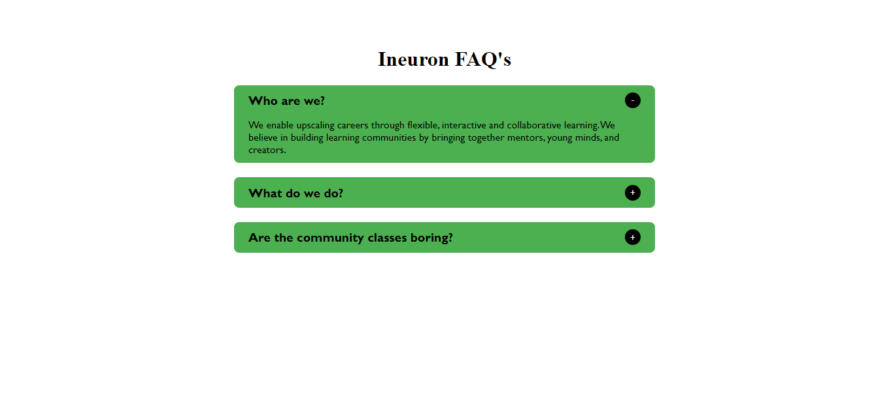
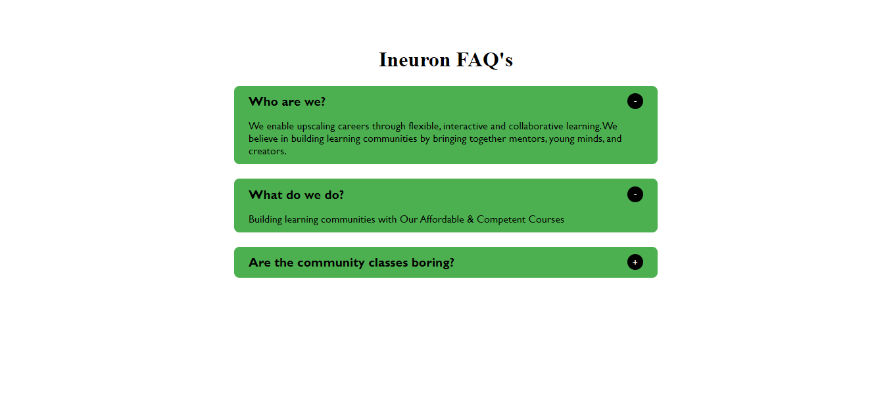

# PRANAV MATHUR

## Learnings from the project:

- DOM methods like _createElement_, _appendChild_, _setAttribute_ and **addEventListener**
- Separating code into different functions so it becomes more readable

## Time taken:

    It took me an hour to complete this project.

## Screenshots:

## Live link:

[Go to site](https://01-accordian.netlify.app/)
